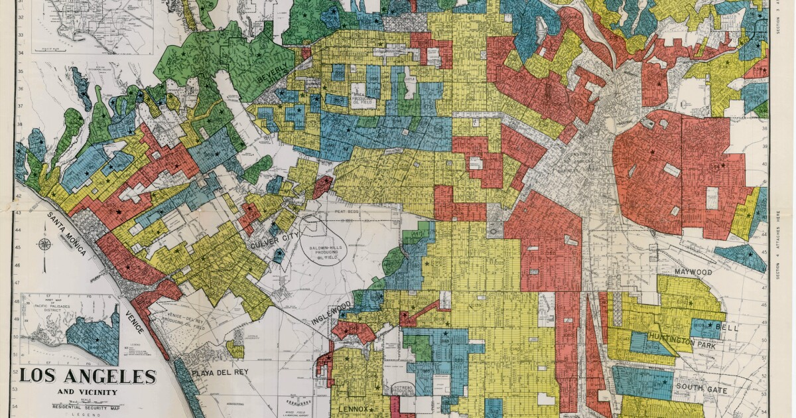

# Examining Effects of Historical Redlining in Los Angeles County

## About: 



- Visualize Homeowner Loan Corporation Grades for LA census tracks with Tmap
- Categorize census tracts using EJ Screen data 
- Examine relationship among historically redlined census tracts, low income communities, and negative health impacts
- Hypothesize potential sources of bias with regards to missing redlined data and biodiversity data


## Repository Structure

```bash
redlined_la
│
├── data                        
│   ├── ejscreen
│   │     ├──EJSCREEN_2023_BG_Columns.xlsx
│   │     ├──EJSCREEN_2023_BG_StatePct_with_AS_CNMI_GU_VI.gdb
│   │     ├──ejscreen-tech-doc-version-2-2.pdf
│   ├── gbif-birds-LA
│   │     ├── gbif-birds-LA.dbf
│   │     ├──gbif-birds-LA-prj
│   │     ├──gbif-birds-LA.shp
│   │     ├──gbif-birds-La.shx
│   ├── mapping-inequality
│        ├──mapping-inequality-los-angeles.json
│   
├── redlined_la.files
│     ├── figure-html
│     ├── libs
│
├── redlined_la.html  # Rendered html
├── redlined_la.qmd
├── redlined_la.Rproj
├── README.md  
├── LICENSE                      
├── .gitignore  
│
├── images/                       
│   ├── kcet.brightspotcdn.jpg  # Image used in the README
│                
```

## Data:

All relevant data available [here](https://drive.google.com/file/d/14CauXFZkVh_6z2Euq0m1Sq1kHQ31fiMk/view?usp=drive_link).

## References:

Ellis-Soto, D., Chapman, M., & Locke, D. H. (2023). Historical redlining is associated with increasing geographical disparities in bird biodiversity sampling in the United States. Nature Human Behaviour.

Federal Loan Agency. Federal Home Loan Bank Board. Home Owners' Loan Corporation. (07/01/1939 - 02/24/1942).

U.S. Environmental Protection Agency (EPA), 2023. EJScreen Technical Documentation.

Global Biodiversity Information Facility (GBIF). Biodiversity Data. 

## Acknowledgements:

All content from EDS 223: Geospatial Analysis and Remote Sensing. Thank you Dr. Ruth Oliver and Ale Vidal Meza from the MEDS program for all of your invaluable guidance!

